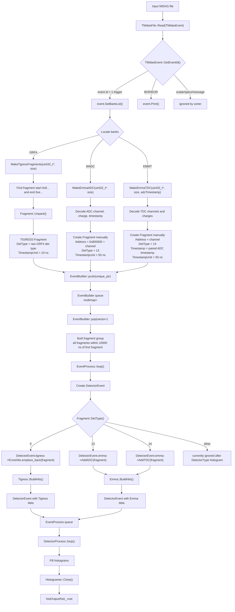
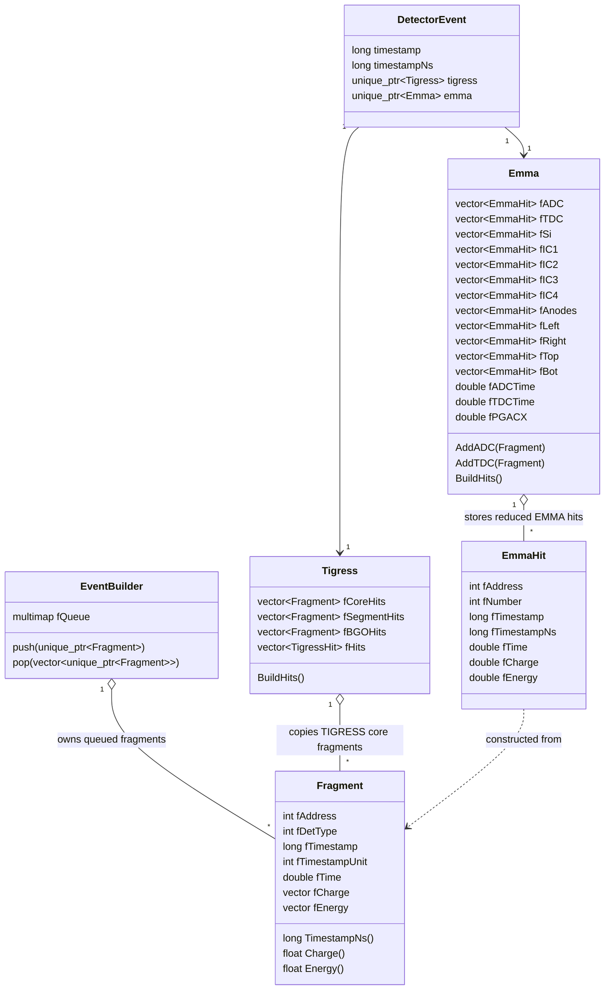

# S2426Sort

S2426Sort is a ROOT/C++ MIDAS sorting program. The current code reads one
MIDAS file, unpacks TIGRESS `GRF4` banks and EMMA `MADC`/`EMMT` banks, converts
the detector-specific raw words into a common `Fragment` representation, builds
time-correlated detector events, groups the fragments into `Tigress` or `Emma`
objects, and fills ROOT histograms.

The calibration file is currently hard-coded in `src/s2426Sort.cxx` as:

```text
cal/CalibrationFile_May1526_pol1.cal
```

## Table of Contents

- [Code Layout](#code-layout)
- [Code Workflow](#code-workflow)
- [Event Building Rule](#event-building-rule)
  - [Input Structure](#input-structure)
  - [Time Units](#time-units)
  - [Pop Rule](#pop-rule)
- [Fragment Class](#fragment-class)
  - [TIGRESS Fragment](#tigress-fragment)
  - [EMMA Fragment](#emma-fragment)
- [DetectorEvent Class](#detectorevent-class)
- [Tigress Class](#tigress-class)
- [Emma Class](#emma-class)
- [Data Structures Between Fragment, DetectorEvent, Tigress, and Emma](#data-structures-between-fragment-detectorevent-tigress-and-emma)
  - [Ownership and Copying](#ownership-and-copying)
- [Histogram Stage](#histogram-stage)
- [Current Implementation Notes](#current-implementation-notes)

## Code Layout

```text
.
├── src/s2426Sort.cxx
│   ├── main MIDAS event loop
│   ├── MakeTigressFragments()
│   ├── MakeEmmaADC()
│   └── MakeEmmaTDC()
├── include/
│   ├── Fragment.h
│   ├── EventBuilder.h
│   ├── EventProcess.h
│   ├── DetectorProcess.h
│   ├── Tigress.h
│   └── Emma.h
├── libraries/
│   ├── TMidas/
│   ├── EventProcessing/
│   ├── Physics/
│   ├── Channel/
│   └── Histogramer/
├── cal/
└── histOutput/
```

## Code Workflow



## Event Building Rule

Event building happens in `EventBuilder`.

### Input Structure

All detector-specific unpackers push `std::unique_ptr<Fragment>` into:

```cpp
std::multimap<long, std::unique_ptr<Fragment>> fQueue;
```

The key is:

```cpp
frag->TimestampNs()
```

`TimestampNs()` is the raw timestamp multiplied by the fragment timestamp unit.

### Time Units

- TIGRESS raw timestamps are interpreted as 10 ns ticks.
- EMMA raw timestamps are interpreted as 50 ns ticks.
- Event building uses `timestampNs`, not raw timestamp ticks.
- The event building window is 10 us, represented as `10000` ns.

### Pop Rule

`EventBuilder::pop()` takes the earliest fragment in the queue as `firstTime`.
It then groups all queued fragments whose nanosecond timestamp satisfies:

```cpp
abs(thisTime - firstTime) <= BUILD_WINDOW_NS
```

where:

```cpp
BUILD_WINDOW_NS = 10000;
```

Before flushing, the builder also waits for reorder slack:

```cpp
safeTime = fLatestTimestampNsSeen - BUILD_WINDOW_NS - REORDER_SLACK_NS;
REORDER_SLACK_NS = 500000000;
```

If the earliest fragment is newer than `safeTime`, the group is not released yet.
At the end of the input file, `main()` calls:

```cpp
EventBuilder::Get()->Flush();
```

After flushing, the builder releases remaining fragments without waiting for
future timestamps.

## Fragment Class

`Fragment` is the common low-level detector data container. Both TIGRESS and
EMMA data are converted into this class before event building.

Important fields:

```text
fAddress        detector/channel address
fDetType        detector type used for routing
fTimestamp      raw timestamp
fTimestampUnit  ns per timestamp tick
fTime           calculated floating time
fCfd            CFD value
fFilterPattern  filter pattern
fPileup         pileup flag
fCharge         charge vector
fEnergy         calibrated energy vector
fInt            integration vector
```

Important methods:

```text
Unpack()          unpack TIGRESS GRF4 data
SetTimestampUnit  set ns/tick and update fTime
TimestampNs()     return fTimestamp * fTimestampUnit
AddCharge()       add charge and calculate calibrated energy
Charge()          return charge normalized by integration
Energy()          return first calibrated energy
Name()/Number()   resolve address through Channel map
```

### TIGRESS Fragment

TIGRESS fragments are created in `MakeTigressFragments()`:

1. Search the `GRF4` bank for a fragment start word with high nibble `0x8`.
2. Search for the matching end word with high nibble `0xe`.
3. Create `std::unique_ptr<Fragment>`.
4. Call `Fragment::Unpack(pStart, nwords)`.
5. If unpack succeeds, push the fragment into `EventBuilder`.

`Fragment::Unpack()` decodes TIGRESS address, detector type, timestamp, CFD,
charge, integration, pileup, and filter pattern. It sets:

```text
TimestampUnit = 10 ns
```

### EMMA Fragment

EMMA fragments are not decoded through `Fragment::Unpack()`. They are created
manually in `MakeEmmaADC()` and `MakeEmmaTDC()`.

EMMA ADC fragment:

```text
Address       = 0x800000 + channel
DetType       = 13
Timestamp     = decoded MADC timestamp
TimestampUnit = 50 ns
Charge        = MADC ADC charge
```

EMMA TDC fragment:

```text
Address       = decoded TDC channel
DetType       = 14
Timestamp     = paired EMMA ADC timestamp
TimestampUnit = 50 ns
Charge        = decoded TDC measurement
```

Current code calculates a TDC timestamp internally, but the fragment timestamp is
set to the paired ADC timestamp passed into `MakeEmmaTDC()`.

## DetectorEvent Class

`DetectorEvent` is defined as a struct in `EventProcess.h`. It is the mid-level
event object created from one built fragment group.

```cpp
struct DetectorEvent {
  long timestamp{0};
  long timestampNs{0};

  std::unique_ptr<Tigress> tigress;
  std::unique_ptr<Emma> emma;

  bool Empty() const {
    return !tigress;
  }
};
```

Construction rule in `EventProcess::loop()`:

1. Get one `vector<unique_ptr<Fragment>>` from `EventBuilder::pop()`.
2. Set `DetectorEvent.timestamp` and `timestampNs` from the first fragment.
3. Allocate one `Tigress` object.
4. Allocate one `Emma` object.
5. Route each fragment by `DetType()`.

Routing table:

```text
DetType 0   -> Tigress::fCoreHits
DetType 13  -> Emma::AddADC()
DetType 14  -> Emma::AddTDC()
other       -> no detector object storage in current code
```

After routing:

```cpp
event.tigress->BuildHits();
event.emma->BuildHits();
```

Then the completed `DetectorEvent` is pushed into the `EventProcess` queue for
`DetectorProcess`.

## Tigress Class

`Tigress` is the detector-level container for TIGRESS fragments.

Stored data:

```text
fCoreHits     vector<Fragment>
fSegmentHits  vector<Fragment>
fBGOHits      vector<Fragment>
fHits         vector<TigressHit>
```

Current routing only fills:

```cpp
event.tigress->fCoreHits.emplace_back(*frag);
```

for `DetType == 0`.

`Tigress::BuildHits()` currently loops over `fCoreHits` and creates a
`TigressHit` for each core fragment:

```cpp
for(auto &frag : fCoreHits) {
  TigressHit hit(frag);
  fHits.emplace_back(hit);
}
```

At the moment, `TigressHit::TigressHit(Fragment&)` is present but does not copy
fragment fields into the hit object yet. Downstream histogramming in
`DetectorProcess` still reads directly from `event.tigress->fCoreHits`.

## Emma Class

`Emma` is the detector-level container for EMMA ADC and TDC fragments after they
have been converted into `EmmaHit`.

Raw reduced hit storage:

```text
fADC  vector<EmmaHit>
fTDC  vector<EmmaHit>
```

Grouped detector storage:

```text
fSi
fIC1
fIC2
fIC3
fIC4
fAnodes
fLeft
fRight
fTop
fBot
```

Derived values:

```text
fADCTime
fTDCTime
fPGACX
```

`Emma::AddADC()` and `Emma::AddTDC()` copy a `Fragment` into an `EmmaHit`.
`EmmaHit` stores:

```text
address
channel number from Channel map
raw timestamp
timestampNs
time
charge
energy
```

`Emma::BuildHits()` first sets:

```text
fADCTime = first ADC hit timestampNs
fTDCTime = first TDC hit timestampNs
```

Then it groups ADC hits by low address byte:

```text
channel 3   -> fSi
channel 16  -> fIC1
channel 17  -> fIC2
channel 18  -> fIC3
channel 19  -> fIC4
```

And groups TDC hits by low address byte:

```text
channel 0-2 -> fAnodes
channel 3   -> fLeft
channel 4   -> fRight
channel 5   -> fTop
channel 6   -> fBot
```

Finally it calculates:

```cpp
fPGACX = CalculatePGACX();
```

`CalculatePGACX()` uses anode, left, and right signals. It returns `NaN` when
the required inputs are incomplete or the left/right sum is zero.

## Data Structures Between Fragment, DetectorEvent, Tigress, and Emma



### Ownership and Copying

- Before event building, fragments are owned by `EventBuilder` as
  `unique_ptr<Fragment>`.
- `EventBuilder::pop()` moves a group into
  `vector<unique_ptr<Fragment>> builtfrags`.
- `EventProcess` copies TIGRESS fragments into `Tigress::fCoreHits`.
- `EventProcess` converts EMMA fragments into `EmmaHit` through `AddADC()` and
  `AddTDC()`.
- `DetectorEvent` owns one `Tigress` and one `Emma` via `unique_ptr`.
- `DetectorProcess` consumes completed `DetectorEvent` objects from
  `EventProcess`.

## Histogram Stage

`DetectorProcess::loop()` pops `DetectorEvent` objects and fills histograms:

```text
TIGRESS singles:
  summary

EMMA singles:
  emma_adc_tdc_time = event.emma->ADCTime() - event.emma->TDCTime()

TIGRESS-EMMA coincidences:
  emma_tig_dt = event.emma->ADCTime() - TIGRESS core timestampNs
```

During earlier stages, the code also fills:

```text
GRF4/DetType
DetectorType
```

At shutdown, `Histogramer::Close()` writes all histograms into the ROOT output
file.

## Current Implementation Notes

- `main()` expects `argv[1]`; missing input arguments are not checked.
- `EventBuilder::loop()` currently only keeps the worker alive. Actual grouping
  is done when `EventProcess::loop()` calls `EventBuilder::pop()`.
- `DetectorEvent::Empty()` only checks whether `tigress` exists.
- TIGRESS segment and BGO vectors exist, but the current routing only fills
  TIGRESS core hits for `DetType == 0`.
- EMMA TDC fragments use the paired ADC timestamp for event building.
