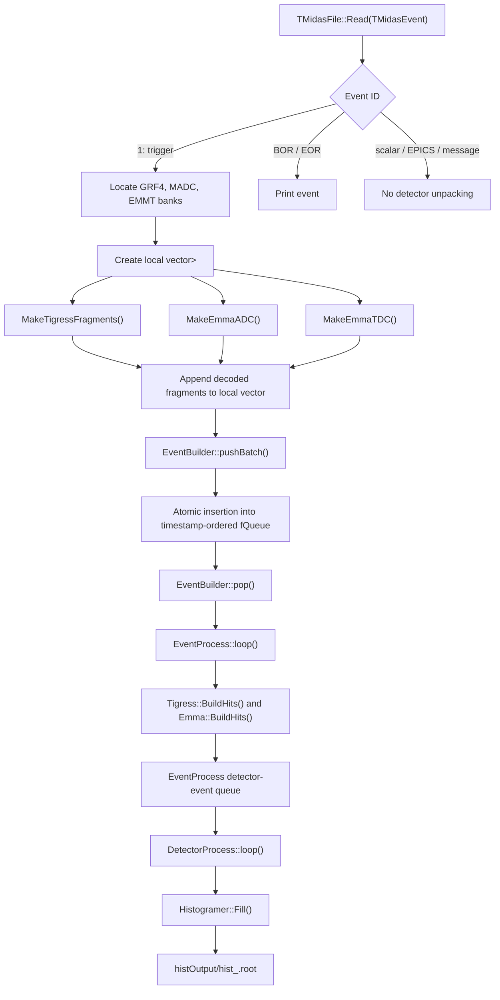
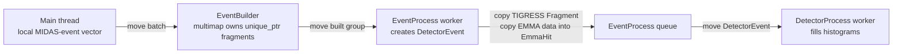

# S2426Sort

S2426Sort is a ROOT/C++ sorter for MIDAS data containing TIGRESS and EMMA
detector banks. It reads one MIDAS file, decodes detector-specific data into a
common `Fragment` type, atomically submits all fragments from each MIDAS event
to a timestamp-ordered queue, builds time-correlated detector events, and writes
ROOT histograms.

## Contents

- [Build and run](#build-and-run)
- [Project layout](#project-layout)
- [Processing pipeline](#processing-pipeline)
- [MIDAS event unpacking](#midas-event-unpacking)
- [Atomic fragment submission](#atomic-fragment-submission)
- [Event building](#event-building)
- [Detector event processing](#detector-event-processing)
- [TIGRESS data](#tigress-data)
- [EMMA data](#emma-data)
- [Histogram processing](#histogram-processing)
- [Ownership and threading](#ownership-and-threading)
- [End-of-run handling](#end-of-run-handling)
- [Current implementation notes](#current-implementation-notes)

## Build and run

The project uses CMake and ROOT.

```bash
make
./bin/s2426Sort path/to/run.mid
```

The calibration file is currently selected in `src/s2426Sort.cxx`:

```text
cal/CalibrationFile_May1526_pol1.cal
```

The run and subrun numbers are parsed from the input filename. Histograms are
written to:

```text
histOutput/hist<run>_<subrun>.root
```

## Project layout

```text
.
├── src/
│   └── s2426Sort.cxx
├── include/
│   ├── Channel.h
│   ├── DetectorProcess.h
│   ├── Emma.h
│   ├── EventBuilder.h
│   ├── EventProcess.h
│   ├── Fragment.h
│   ├── Histogramer.h
│   ├── Tigress.h
│   ├── TMidasEvent.h
│   └── TMidasFile.h
├── libraries/
│   ├── Channel/
│   ├── EventProcessing/
│   ├── Histogramer/
│   ├── Physics/
│   ├── TChannel/
│   └── TMidas/
├── cal/
├── histOutput/
├── CMakeLists.txt
└── makefile
```

The main processing components are:

| Component | Responsibility |
|---|---|
| `s2426Sort.cxx` | Read MIDAS events and decode GRF4, MADC, and EMMT banks |
| `Fragment` | Common representation for TIGRESS and EMMA raw hits |
| `EventBuilder` | Own and time-order fragments; form built fragment groups |
| `EventProcess` | Route built fragments into `Tigress` and `Emma` objects |
| `DetectorProcess` | Fill detector and coincidence histograms |
| `Histogramer` | Create, own, and write ROOT histograms |

## Processing pipeline


```mermaid
flowchart TD
  A["TMidasFile::Read(TMidasEvent)"] --> B{"Event ID"}
  B -->|"1: trigger"| C["Locate GRF4, MADC, EMMT banks"]
  B -->|"BOR / EOR"| D["Print event"]
  B -->|"scalar / EPICS / message"| E["No detector unpacking"]

  C --> F["Create local vector<unique_ptr<Fragment>>"]
  F --> G["MakeTigressFragments()"]
  F --> H["MakeEmmaADC()"]
  F --> I["MakeEmmaTDC()"]

  G --> J["Append decoded fragments to local vector"]
  H --> J
  I --> J

  J --> K["EventBuilder::pushBatch()"]
  K --> L["Atomic insertion into timestamp-ordered fQueue"]
  L --> M["EventBuilder::pop()"]
  M --> N["EventProcess::loop()"]
  N --> O["Tigress::BuildHits() and Emma::BuildHits()"]
  O --> P["EventProcess detector-event queue"]
  P --> Q["DetectorProcess::loop()"]
  Q --> R["Histogramer::Fill()"]
  R --> S["histOutput/hist<run>_<subrun>.root"]
```

## MIDAS event unpacking

Only trigger events with MIDAS event ID `1` are unpacked into detector
fragments. For each trigger event, `main()` creates:

```cpp
std::vector<std::unique_ptr<Fragment>> fragments;
```

The banks are processed in this order:

1. `GRF4` through `MakeTigressFragments()`
2. `MADC` through `MakeEmmaADC()`
3. `EMMT` through `MakeEmmaTDC()`

Each unpacker appends decoded fragments to the same local vector. The unpackers
do not directly insert fragments into the global EventBuilder queue.

The current function interfaces are:

```cpp
void MakeTigressFragments(
  uint32_t*,
  int,
  std::vector<std::unique_ptr<Fragment>>&);

long MakeEmmaADC(
  uint32_t*,
  int,
  std::vector<std::unique_ptr<Fragment>>&);

void MakeEmmaTDC(
  uint32_t*,
  int,
  long,
  std::vector<std::unique_ptr<Fragment>>&);
```

After all available banks from the MIDAS event have been decoded, `main()`
submits the vector:

```cpp
EventBuilder::Get()->pushBatch(std::move(fragments));
```

## Atomic fragment submission

`EventBuilder::pushBatch()` holds `fMutex` while inserting the complete
MIDAS-event batch:

```cpp
void EventBuilder::pushBatch(
  std::vector<std::unique_ptr<Fragment>> fragments);
```

For each non-null fragment, it:

1. Calculates `ts = frag->TimestampNs()`.
2. Updates `fLatestTimestampNsSeen` when `ts` is newer.
3. Moves the fragment into `fQueue`.
4. Increments `fPushed`.

The complete batch is inserted under one lock. `EventBuilder::pop()` therefore
cannot run between MADC and EMMT insertion for the same MIDAS event.

`EventBuilder::push()` remains available for single-fragment insertion, but
the main MIDAS unpacking path uses `pushBatch()`.

`fPushed` is a diagnostic counter for the total number of fragments accepted
by EventBuilder. It does not control queue capacity or event grouping.

## Event building

### Queue structure

EventBuilder stores fragments in:

```cpp
std::multimap<long, std::unique_ptr<Fragment>> fQueue;
```

The multimap key is `Fragment::TimestampNs()`. The queue has no configured
fixed fragment capacity; it grows dynamically as required.

### Timestamp units

| Fragment source | Raw timestamp unit |
|---|---:|
| TIGRESS GRF4 | 10 ns |
| EMMA MADC | 50 ns |
| EMMA EMMT | 50 ns |

Event building always compares nanosecond timestamps returned by
`TimestampNs()`.

### Build window

The current constants in `EventBuilder.h` are:

```cpp
static constexpr long BUILD_WINDOW_NS  = 5000;
static constexpr long REORDER_SLACK_NS = 500000000;
```

The build window is therefore 5 μs. `EventBuilder::pop()` uses the earliest
queued timestamp as `firstTime` and moves currently queued fragments while:

```cpp
std::labs(thisTime - firstTime) <= BUILD_WINDOW_NS
```

This is an anchored window: every included fragment is compared with the first
fragment, not with the previously included fragment.

### Reorder depth

During normal reading, EventBuilder calculates:

```cpp
safeTime =
  fLatestTimestampNsSeen
  - BUILD_WINDOW_NS
  - REORDER_SLACK_NS;
```

If the earliest queued fragment is newer than `safeTime`, `pop()` waits for
more input. The 500 ms value is a timestamp reorder depth, not a fixed memory
buffer size.

## Detector event processing

`EventProcess::loop()` calls `EventBuilder::pop()` and receives:

```cpp
std::vector<std::unique_ptr<Fragment>> builtfrags;
```

For each non-empty built group, it creates:

```cpp
struct DetectorEvent {
  long timestamp{0};
  long timestampNs{0};
  std::unique_ptr<Tigress> tigress;
  std::unique_ptr<Emma> emma;
};
```

Both detector objects are allocated for every built group. Fragments are routed
by `DetType()`:

| DetType | Destination |
|---:|---|
| 0 | `Tigress::fCoreHits` |
| 13 | `Emma::AddADC()` |
| 14 | `Emma::AddTDC()` |
| other | Not stored in a detector object |

After routing:

```cpp
event.tigress->BuildHits();
event.emma->BuildHits();
```

The completed `DetectorEvent` is moved into the EventProcess queue for
DetectorProcess.

## TIGRESS data

`MakeTigressFragments()` searches a GRF4 bank for fragment boundaries:

- Start word: high nibble `0x8`
- End word: high nibble `0xe`

For each candidate, it creates a `Fragment` and calls:

```cpp
frag->Unpack(pStart,nwords);
```

A successfully unpacked TIGRESS fragment contains the decoded address, detector
type, timestamp, CFD, charge, integration, filter pattern, and pileup state. Its
timestamp unit is 10 ns.

EventProcess currently routes only `DetType == 0` into
`Tigress::fCoreHits`. `Tigress::BuildHits()` creates one `TigressHit` per
core fragment, while DetectorProcess fills current histograms directly from
`fCoreHits`.

## EMMA data

EMMA fragments are created manually rather than through `Fragment::Unpack()`.

### MADC fragments

`MakeEmmaADC()` creates:

```text
Address        0x800000 + ADC channel
DetType        13
Timestamp      decoded MADC timestamp
TimestampUnit  50 ns
Charge         decoded ADC charge
```

The last valid MADC timestamp is returned to `main()` and passed to
`MakeEmmaTDC()`.

### EMMT fragments

`MakeEmmaTDC()` decodes TDC channel and measurement words. It also decodes the
hardware TDC timestamp for monitoring, but each created fragment currently uses
the paired ADC timestamp:

```text
Address        decoded TDC channel
DetType        14
Timestamp      paired MADC timestamp
TimestampUnit  50 ns
Charge         decoded TDC measurement
```

### Emma hit grouping

`Emma::AddADC()` and `Emma::AddTDC()` copy reduced fragment quantities into
`EmmaHit` objects. `Emma::BuildHits()` groups hits by the low address byte.

ADC grouping:

| Channel | Collection |
|---:|---|
| 3 | `fSi` |
| 16 | `fIC1` |
| 17 | `fIC2` |
| 18 | `fIC3` |
| 19 | `fIC4` |

TDC grouping:

| Channel | Collection |
|---:|---|
| 0–2 | `fAnodes` |
| 3 | `fLeft` |
| 4 | `fRight` |
| 5 | `fTop` |
| 6 | `fBot` |

`fADCTime` and `fTDCTime` are taken from the first stored ADC and TDC hit.
`CalculatePGACX()` uses anode, left, and right measurements and returns NaN
when its inputs are incomplete or the left/right sum is zero.

## Histogram processing

`DetectorProcess::loop()` consumes completed DetectorEvent objects.

### TIGRESS singles

`summary` is filled from each TIGRESS core fragment using detector number,
crystal color, and calibrated energy.

### EMMA timing

When the Emma object has both an ADC time and a TDC time:

```text
emma_adc_tdc_time = ADCTime - TDCTime
```

### TIGRESS-EMMA histograms

Current histograms include:

| Directory | Histogram |
|---|---|
| `Emma_Tig` | `summary` |
| `Emma_Tig` | `summary_good` |
| `Emma_Tig` | `emma_tig_dt` |
| `Emma_Tig` | `Si Size` |
| `Emma_Tig` | `Anode Size` |
| `Emma_Tig` | `IC1 Size` through `IC4 Size` |
| `Emma_Tig/Si_triggered` | `Anode Size` |

The current `summary_good` condition is:

```cpp
event.emma->Si().size() > 0
&& event.emma->Anodes().size() > 0
&& (event.emma->Left().size() > 0
    || event.emma->Right().size() > 0)
```

Earlier pipeline stages also fill:

- `eTDC`
- `GRF4/DetType`
- `DetectorType`

`Histogramer` protects histogram lookup and filling with a mutex. At shutdown,
`Histogramer::Close()` writes all histogram lists to the ROOT output file.

## Ownership and threading


```mermaid
flowchart LR
  A["Main thread<br/>local MIDAS-event vector"] -->|"move batch"| B["EventBuilder<br/>multimap owns unique_ptr fragments"]
  B -->|"move built group"| C["EventProcess worker<br/>creates DetectorEvent"]
  C -->|"copy TIGRESS Fragment<br/>copy EMMA data into EmmaHit"| D["EventProcess queue"]
  D -->|"move DetectorEvent"| E["DetectorProcess worker<br/>fills histograms"]
```

Ownership changes are:

1. The main thread owns newly decoded fragments in a local
   `vector<unique_ptr<Fragment>>`.
2. `pushBatch()` moves them into EventBuilder's multimap under one mutex lock.
3. `pop()` moves a built group into EventProcess.
4. TIGRESS fragments are copied into `fCoreHits`.
5. EMMA fragments are reduced and copied into `EmmaHit`.
6. The completed DetectorEvent is moved through the EventProcess queue.

EventBuilder has a worker thread, but its `loop()` currently only monitors stop
state and queue emptiness. Event building is performed by the EventProcess
worker when it calls `EventBuilder::pop()`. DetectorProcess runs in a separate
worker thread.

## End-of-run handling

After the MIDAS input loop finishes:

1. `EventBuilder::Flush()` sets the flushing flag.
2. While flushing, the normal reorder-depth hold is disabled.
3. The main thread waits for EventBuilder and EventProcess queues to drain.
4. EventBuilder, EventProcess, and DetectorProcess receive `Stop()`.
5. `Histogramer::Close()` writes the ROOT output file.

Status output reports:

- Input megabytes read and total size
- EventBuilder queue size
- Total fragments accepted by EventBuilder
- Total built groups produced
- EventProcess queue size
- Detector events completed

Reading and queue draining share one four-line status display that refreshes in
place. After processing finishes, a final four-line status is printed normally.

## Current implementation notes

- `main()` expects an input path in `argv[1]`; it does not currently validate
  a missing argument.
- The calibration path is hard-coded.
- The main unpacking path atomically submits one complete MIDAS-event batch, but
  EventBuilder grouping remains timestamp-based and may combine fragments from
  different MIDAS events when they fall inside the 5 μs build window.
- `fQueue` is dynamically sized; `REORDER_SLACK_NS` controls timestamp
  reorder depth rather than memory capacity.
- EMMA TDC fragments use the paired MADC timestamp for event building.
- TIGRESS segment and BGO containers exist, but EventProcess currently routes
  only `DetType == 0` into TIGRESS core storage.
- Worker threads are detached in their constructors. Shutdown behavior is
  controlled through atomic stop flags and queue-drain checks.
