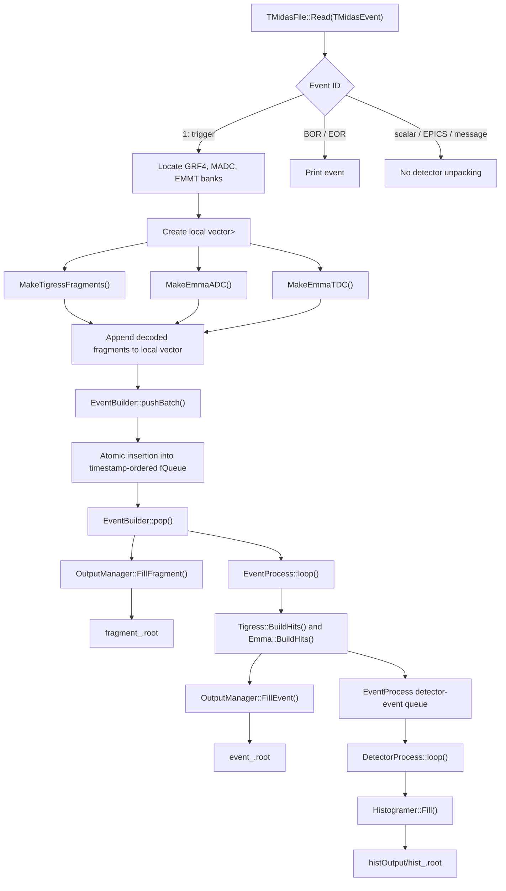
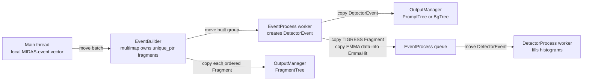

# S2426Sort

S2426Sort is a ROOT/C++ sorter for MIDAS data containing TIGRESS and EMMA
detector banks. It reads one MIDAS file, decodes detector-specific data into a
common `Fragment` type, atomically submits all fragments from each MIDAS event
to a timestamp-ordered queue, builds time-correlated detector events, and writes
ROOT event trees and histograms.

## Contents

- [Build and run](#build-and-run)
- [Project layout](#project-layout)
- [Processing pipeline](#processing-pipeline)
- [MIDAS event unpacking](#midas-event-unpacking)
- [Atomic fragment submission](#atomic-fragment-submission)
- [Event building](#event-building)
- [Detector event processing](#detector-event-processing)
- [TIGRESS data](#tigress-data)
- [EMMA data](#emma-data)
- [Event tree output](#event-tree-output)
- [Histogram processing](#histogram-processing)
- [Ownership and threading](#ownership-and-threading)
- [End-of-run handling](#end-of-run-handling)
- [Current implementation notes](#current-implementation-notes)

## Build and run

The project uses CMake and ROOT.

```bash
make
./bin/s2426Sort path/to/run.mid
```

The build creates `build/lib/libCHANNEL.dylib` on macOS or
`build/lib/libCHANNEL.so` on Linux, together with its ROOT dictionary. Load the
library in ROOT with:

```cpp
gSystem->Load("build/lib/libCHANNEL.dylib");
TClass::GetClass("Channel");
```

The load call returns `0` when newly loaded and `1` when it was already loaded.
Keep the generated `libCHANNEL_rdict.pcm` and `libCHANNEL.rootmap` beside the
shared library.

The calibration file is currently selected in `src/s2426Sort.cxx`:

```text
cal/CalibrationFile_May1526_pol1.cal
```

The run and subrun numbers are parsed from the input filename. Histograms are
written to:

```text
histOutput/hist<run>_<subrun>.root
```

Prompt and background detector events are written to:

```text
event<run>_<subrun>.root
```

Deduplicated, time-ordered fragments are written to:

```text
fragment<run>_<subrun>.root
```

## Project layout

```text
.
├── src/
│   └── s2426Sort.cxx
├── include/
│   ├── Channel.h
│   ├── DetectorProcess.h
│   ├── Emma.h
│   ├── EventBuilder.h
│   ├── EventProcess.h
│   ├── Fragment.h
│   ├── Histogramer.h
│   ├── OutputManager.h
│   ├── Tigress.h
│   ├── TMidasEvent.h
│   └── TMidasFile.h
├── libraries/
│   ├── Channel/
│   ├── EventProcessing/
│   ├── Histogramer/
│   ├── OutputManager/
│   ├── Physics/
│   ├── TChannel/
│   └── TMidas/
├── cal/
├── histOutput/
├── CMakeLists.txt
└── makefile
```

The main processing components are:

| Component | Responsibility |
|---|---|
| `s2426Sort.cxx` | Read MIDAS events and decode GRF4, MADC, and EMMT banks |
| `Fragment` | Common representation for TIGRESS and EMMA raw hits |
| `EventBuilder` | Own and time-order fragments; form built fragment groups |
| `EventProcess` | Route built fragments into `Tigress` and `Emma` objects |
| `DetectorProcess` | Fill detector and coincidence histograms |
| `Histogramer` | Create, own, and write ROOT histograms |
| `OutputManager` | Create, fill, and write event and fragment trees |

## Processing pipeline


```mermaid
flowchart TD
  A["TMidasFile::Read(TMidasEvent)"] --> B{"Event ID"}
  B -->|"1: trigger"| C["Locate GRF4, MADC, EMMT banks"]
  B -->|"BOR / EOR"| D["Print event"]
  B -->|"scalar / EPICS / message"| E["No detector unpacking"]

  C --> F["Create local vector<unique_ptr<Fragment>>"]
  F --> G["MakeTigressFragments()"]
  F --> H["MakeEmmaADC()"]
  F --> I["MakeEmmaTDC()"]

  G --> J["Append decoded fragments to local vector"]
  H --> J
  I --> J

  J --> K["EventBuilder::pushBatch()"]
  K --> L["Atomic insertion into timestamp-ordered fQueue"]
  L --> M["EventBuilder::pop()"]
  M --> V["OutputManager::FillFragment()"]
  V --> W["fragment<run>_<subrun>.root"]
  M --> N["EventProcess::loop()"]
  N --> O["Tigress::BuildHits() and Emma::BuildHits()"]
  O --> T["OutputManager::FillEvent()"]
  T --> U["event<run>_<subrun>.root"]
  O --> P["EventProcess detector-event queue"]
  P --> Q["DetectorProcess::loop()"]
  Q --> R["Histogramer::Fill()"]
  R --> S["histOutput/hist<run>_<subrun>.root"]
```

## MIDAS event unpacking

Only trigger events with MIDAS event ID `1` are unpacked into detector
fragments. For each trigger event, `main()` creates:

```cpp
std::vector<std::unique_ptr<Fragment>> fragments;
```

The banks are processed in this order:

1. `GRF4` through `MakeTigressFragments()`
2. `MADC` through `MakeEmmaADC()`
3. `EMMT` through `MakeEmmaTDC()`

Each unpacker appends decoded fragments to the same local vector. The unpackers
do not directly insert fragments into the global EventBuilder queue.

The current function interfaces are:

```cpp
void MakeTigressFragments(
  uint32_t*,
  int,
  std::vector<std::unique_ptr<Fragment>>&);

long MakeEmmaADC(
  uint32_t*,
  int,
  std::vector<std::unique_ptr<Fragment>>&);

void MakeEmmaTDC(
  uint32_t*,
  int,
  long,
  std::vector<std::unique_ptr<Fragment>>&);
```

After all available banks from the MIDAS event have been decoded, `main()`
submits the vector:

```cpp
EventBuilder::Get()->pushBatch(std::move(fragments));
```

## Atomic fragment submission

`EventBuilder::pushBatch()` holds `fMutex` while inserting the complete
MIDAS-event batch:

```cpp
void EventBuilder::pushBatch(
  std::vector<std::unique_ptr<Fragment>> fragments);
```

For each non-null fragment, it:

1. Calculates `ts = frag->TimestampNs()` and updates the latest timestamp.
2. For channels below 720 and channel 849, records `(Address, TimestampNs)`.
3. Removes repeated keys within the current MIDAS-event batch.
4. Removes keys observed in the preceding GRF4 batch, keeping the earlier hit.
5. Moves the retained fragments into `fQueue` and increments `fPushed`.

Only the preceding batch's observed key set is retained, so duplicate tracking
has bounded memory use. Keys remain recorded even when their current fragments
are removed by the cross-batch check; this also suppresses the same hit when it
is repeated in three consecutive batches. Other EMMA ADC and TDC channels do
not participate in duplicate cleaning.

The complete batch is inserted under one lock. `EventBuilder::pop()` therefore
cannot run between MADC and EMMT insertion for the same MIDAS event.

`EventBuilder::push()` remains available for single-fragment insertion, but
the main MIDAS unpacking path uses `pushBatch()`.

`fPushed` is a diagnostic counter for the total number of fragments accepted
by EventBuilder. It does not control queue capacity or event grouping.

## Event building

### Queue structure

EventBuilder stores fragments in:

```cpp
std::multimap<long, std::unique_ptr<Fragment>> fQueue;
```

The multimap key is `Fragment::TimestampNs()`. The queue has no configured
fixed fragment capacity; it grows dynamically as required.

### Timestamp units

| Fragment source | Raw timestamp unit |
|---|---:|
| TIGRESS GRF4 | 10 ns |
| EMMA MADC | 50 ns |
| EMMA EMMT | 50 ns |

Event building always compares nanosecond timestamps returned by
`TimestampNs()`.

### Build window

The current constants in `EventBuilder.h` are:

```cpp
static constexpr long BUILD_WINDOW_NS  = 5000;
static constexpr long REORDER_SLACK_NS = 500000000;
```

The build window is therefore 5 μs. `EventBuilder::pop()` uses the earliest
queued timestamp as `firstTime` and moves currently queued fragments while:

```cpp
std::labs(thisTime - firstTime) <= BUILD_WINDOW_NS
```

This is an anchored window: every included fragment is compared with the first
fragment, not with the previously included fragment.

### Reorder depth

During normal reading, EventBuilder calculates:

```cpp
safeTime =
  fLatestTimestampNsSeen
  - BUILD_WINDOW_NS
  - REORDER_SLACK_NS;
```

If the earliest queued fragment is newer than `safeTime`, `pop()` waits for
more input. The 500 ms value is a timestamp reorder depth, not a fixed memory
buffer size.

## Detector event processing

`EventProcess::loop()` calls `EventBuilder::pop()` and receives:

```cpp
std::vector<std::unique_ptr<Fragment>> builtfrags;
```

For each non-empty built group, it creates:

```cpp
struct DetectorEvent {
  long timestampNs{0};
  Tigress tigress;
  Emma emma;
};
```

Both detector objects are stored by value in every built group. Fragments are
routed by `DetType()`:

| DetType | Destination |
|---:|---|
| 0 | `Tigress::fCoreHits` |
| 2 | `Tigress::fSegmentHits` |
| 3 | `Tigress::fBGOHits` |
| 8 | Store the EMT nanosecond timestamp in `DetectorEvent::timestampNs` |
| 13 | `Emma::AddADC()` |
| 14 | `Emma::AddTDC()` |
| other | Not stored in a detector object |

After routing:

```cpp
event.tigress.BuildHits();
event.emma.BuildHits();
```

`OutputManager::FillEvent()` then copies the complete `DetectorEvent` into its
`event` branch buffer. A nonzero EMT timestamp selects `PromptTree`; a zero
timestamp selects `BgTree`. The completed event is subsequently moved into the
EventProcess queue for DetectorProcess.

## TIGRESS data

`MakeTigressFragments()` searches a GRF4 bank for fragment boundaries:

- Start word: high nibble `0x8`
- End word: high nibble `0xe`

For each candidate, it creates a `Fragment` and calls:

```cpp
frag->Unpack(pStart,nwords);
```

A successfully unpacked TIGRESS fragment contains the decoded address, detector
type, timestamp, CFD, charge, integration, filter pattern, and pileup state. Its
timestamp unit is 10 ns.

EventProcess routes core, segment, and BGO fragments into `fCoreHits`,
`fSegmentHits`, and `fBGOHits`. These three `vector<Fragment>` members are the
temporary persisted TIGRESS representation. `fHits` is currently transient,
while DetectorProcess fills current histograms directly from `fCoreHits`.

## EMMA data

EMMA fragments are created manually rather than through `Fragment::Unpack()`.

### MADC fragments

`MakeEmmaADC()` creates:

```text
Address        0x800000 + ADC channel
DetType        13
Timestamp      decoded MADC timestamp
TimestampUnit  50 ns
Charge         decoded ADC charge
```

The last valid MADC timestamp is returned to `main()` and passed to
`MakeEmmaTDC()`.

### EMMT fragments

`MakeEmmaTDC()` decodes TDC channel and measurement words. It also decodes the
hardware TDC timestamp for monitoring, but each created fragment currently uses
the paired ADC timestamp:

```text
Address        decoded TDC channel
DetType        14
Timestamp      paired MADC timestamp
TimestampUnit  50 ns
Charge         decoded TDC measurement
```

### Emma hit grouping

`Emma::AddADC()` and `Emma::AddTDC()` copy reduced fragment quantities into
`EmmaHit` objects. `Emma::BuildHits()` groups hits by the low address byte.

ADC grouping:

| Channel | Collection |
|---:|---|
| 3 | `fSi` |
| 16 | `fIC1` |
| 17 | `fIC2` |
| 18 | `fIC3` |
| 19 | `fIC4` |

TDC grouping:

| Channel | Collection |
|---:|---|
| 0–2 | `fAnodes` |
| 3 | `fLeft` |
| 4 | `fRight` |
| 5 | `fTop` |
| 6 | `fBot` |

`fADCTime` and `fTDCTime` are taken from the first stored ADC and TDC hit.
`CalculatePGACX()` uses anode, left, and right measurements and returns NaN
when its inputs are incomplete or the left/right sum is zero.

## Event tree output

`OutputManager` writes the detector events to one ROOT file with two trees:

| Tree | Selection | Branches |
|---|---|---|
| `PromptTree` | `DetectorEvent::timestampNs != 0` | `event` (`DetectorEvent`) |
| `BgTree` | `DetectorEvent::timestampNs == 0` | `event` (`DetectorEvent`) |

Both trees are written even when one of them has zero entries. The temporary
TIGRESS schema stores individual core, segment, and BGO `Fragment` objects.
EMMA stores reduced `EmmaHit` objects and its detector-group collections.

The same manager writes a separate fragment ROOT file:

| File | Tree | Selection | Branch |
|---|---|---|---|
| `fragment<run>_<subrun>.root` | `FragmentTree` | Deduplicated fragments in timestamp order | `Fragment` |

FragmentTree is filled in `EventBuilder::pop()` immediately before each
fragment is moved from the timestamp-sorted queue into `builtfrags`. Filling at
this point preserves global queue order rather than only the order within one
MIDAS input batch.

The ROOT dictionaries and shared libraries are generated under `build/lib`.
An interactive ROOT session can load the data model with:

```cpp
gSystem->AddDynamicPath("build/lib");
gSystem->Load("libOUTPUTMANAGER");
```

Load the calibration file before using `Fragment::Name()`, `Number()`, or other
methods that resolve an address through `Channel`.

## Histogram processing

`DetectorProcess::loop()` consumes completed DetectorEvent objects.

### TIGRESS singles

`summary` is filled from each TIGRESS core fragment using detector number,
crystal color, and calibrated energy.

### EMMA timing

When the Emma object has both an ADC time and a TDC time:

```text
emma_adc_tdc_time = ADCTime - TDCTime
```

### TIGRESS-EMMA histograms

Current histograms include:

| Directory | Histogram |
|---|---|
| `Emma_Tig` | `summary` |
| `Emma_Tig` | `summary_good` |
| `Emma_Tig` | `emma_tig_dt` |
| `Emma_Tig` | `Si Size` |
| `Emma_Tig` | `Anode Size` |
| `Emma_Tig` | `IC1 Size` through `IC4 Size` |
| `Emma_Tig/Si_triggered` | `Anode Size` |

The current `summary_good` condition is:

```cpp
event.emma.Si().size() > 0
&& event.emma.Anodes().size() > 0
&& (event.emma.Left().size() > 0
    || event.emma.Right().size() > 0)
```

Earlier pipeline stages also fill:

- `eTDC`
- `GRF4/DetType`
- `DetectorType`

`Histogramer` protects histogram lookup and filling with a mutex. At shutdown,
`Histogramer::Close()` writes all histogram lists to the ROOT output file.

## Ownership and threading


```mermaid
flowchart LR
  A["Main thread<br/>local MIDAS-event vector"] -->|"move batch"| B["EventBuilder<br/>multimap owns unique_ptr fragments"]
  B -->|"move built group"| C["EventProcess worker<br/>creates DetectorEvent"]
  B -->|"copy each ordered Fragment"| G["OutputManager<br/>FragmentTree"]
  C -->|"copy DetectorEvent"| F["OutputManager<br/>PromptTree or BgTree"]
  C -->|"copy TIGRESS Fragment<br/>copy EMMA data into EmmaHit"| D["EventProcess queue"]
  D -->|"move DetectorEvent"| E["DetectorProcess worker<br/>fills histograms"]
```

Ownership changes are:

1. The main thread owns newly decoded fragments in a local
   `vector<unique_ptr<Fragment>>`.
2. `pushBatch()` removes same-batch and adjacent-batch GRF4 duplicates, then
   moves the retained fragments into EventBuilder's multimap under one mutex.
3. `pop()` copies each ordered Fragment into FragmentTree, then moves the built
   group into EventProcess.
4. TIGRESS fragments are copied into `fCoreHits`.
5. EMMA fragments are reduced and copied into `EmmaHit`.
6. OutputManager copies the complete DetectorEvent into the selected tree's
   `event` branch buffer and fills one entry.
7. The completed DetectorEvent is moved through the EventProcess queue.

EventBuilder has a worker thread, but its `loop()` currently only monitors stop
state and queue emptiness. Event building is performed by the EventProcess
worker when it calls `EventBuilder::pop()`. DetectorProcess runs in a separate
worker thread.

## End-of-run handling

After the MIDAS input loop finishes:

1. `EventBuilder::Flush()` sets the flushing flag.
2. While flushing, the normal reorder-depth hold is disabled.
3. The main thread waits for both queues to drain and for EventProcess to
   publish every built event.
4. EventBuilder, EventProcess, and DetectorProcess receive `Stop()`.
5. `OutputManager::Close()` writes `PromptTree`, `BgTree`, and the separately
   stored `FragmentTree`.
6. `Histogramer::Close()` writes the histogram ROOT file.

Status output reports:

- Input megabytes read and total size
- EventBuilder queue size
- Total fragments accepted by EventBuilder
- Total built groups produced
- EventProcess queue size
- Detector events completed

Reading and queue draining share one four-line status display that refreshes in
place. After processing finishes, a final four-line status is printed normally.

## Current implementation notes

- `main()` expects an input path in `argv[1]`; it does not currently validate
  a missing argument.
- The calibration path is hard-coded.
- The main unpacking path atomically submits one complete MIDAS-event batch, but
  EventBuilder grouping remains timestamp-based and may combine fragments from
  different MIDAS events when they fall inside the 5 μs build window.
- `fQueue` is dynamically sized; `REORDER_SLACK_NS` controls timestamp
  reorder depth rather than memory capacity.
- EMMA TDC fragments use the paired MADC timestamp for event building.
- TIGRESS currently persists raw `Fragment` vectors as a temporary analysis
  schema; `TigressHit::fHits` is not written.
- Worker threads are detached in their constructors. Shutdown behavior is
  controlled through atomic stop flags and queue-drain checks.
