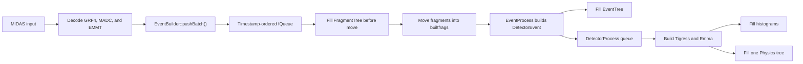

# S2426Sort

S2426Sort is a ROOT/C++ sorter for MIDAS data containing TIGRESS and EMMA
detector banks. It decodes raw banks into `Fragment` objects, removes repeated
GRF4 data, time-orders fragments, builds `DetectorEvent` objects, constructs
detector-level physics objects, fills histograms, and writes ROOT trees.

## Build and run

The project uses CMake and ROOT.

```bash
make
./bin/s2426Sort path/to/run.mid
```

The calibration file is currently selected in `src/s2426Sort.cxx`:

```text
cal/CalibrationFile_May1526_pol1.cal
```

Run and subrun numbers are parsed from the input filename.

## Output files

Histograms remain controlled by `Histogramer` and are written to:

```text
histOutput/hist<run>_<subrun>.root
```

All TTree files are written under `ttreeOutput`:

```text
ttreeOutput/fragment<run>_<subrun>.root
ttreeOutput/event<run>_<subrun>.root
ttreeOutput/physics<run>_<subrun>.root
```

Their schemas are:

```text
fragment<run>_<subrun>.root
└── FragmentTree
    └── Fragment       (Fragment)

event<run>_<subrun>.root
└── EventTree
    └── DetectorEvent  (DetectorEvent)

physics<run>_<subrun>.root
├── BgTree
│   ├── Emma           (Emma)
│   └── Tigress        (Tigress)
├── PromptGoodTree
│   ├── Emma           (Emma)
│   └── Tigress        (Tigress)
└── PromptBadTree
    ├── Emma           (Emma)
    └── Tigress        (Tigress)
```

## Processing pipeline


```mermaid
flowchart LR
  A["MIDAS input"] --> B["Decode GRF4, MADC, and EMMT"]
  B --> C["EventBuilder::pushBatch()"]
  C --> D["Timestamp-ordered fQueue"]
  D --> E["Fill FragmentTree before move"]
  E --> F["Move fragments into builtfrags"]
  F --> G["EventProcess builds DetectorEvent"]
  G --> H["Fill EventTree"]
  G --> I["DetectorProcess queue"]
  I --> J["Build Tigress and Emma"]
  J --> K["Fill histograms"]
  J --> L["Fill one Physics tree"]
```

The selected two-stage event design is:

| Thread | Responsibility |
|---|---|
| Main | Read MIDAS data and decode detector banks |
| EventProcess | Pop built fragment groups, create `DetectorEvent`, and fill EventTree |
| DetectorProcess | Build `Tigress` and `Emma`, fill histograms, and fill Physics trees |

`OutputManager` protects all `TTree::Fill()` calls with one mutex. ROOT writes
are serialized while event construction and detector processing remain in
separate worker threads.

## Fragment decoding and cleanup

The main input loop decodes available banks into one local vector:

```cpp
std::vector<std::unique_ptr<Fragment>> fragments;
```

The banks are processed in this order:

1. GRF4 through `MakeTigressFragments()`.
2. MADC through `MakeEmmaADC()`.
3. EMMT through `MakeEmmaTDC()`.

`EventBuilder::pushBatch()` removes exact GRF4 duplicates within the current
MIDAS batch and across adjacent batches. `Fragment` itself is not modified by
the event and physics data-model changes.

EMMT decoding retains leading measurements and discards trailing measurements.
Same-address EMMT cleanup is not performed during decoding, in EventBuilder,
in FragmentTree, or in EventTree. It is performed only while building `Emma`
for the Physics output.

## Event building

EventBuilder stores accepted fragments in:

```cpp
std::multimap<long, std::unique_ptr<Fragment>> fQueue;
```

The key is `Fragment::TimestampNs()`. An EMMA anode fragment (DetType 14,
channel 0--2) supplies the event-building reference. The prompt build window is:

```cpp
static constexpr std::pair<long, long> BUILD_WINDOW_NS = {-400, 2600};
```

Before a fragment is moved out of `fQueue`, `EventBuilder::pop()` calls:

```cpp
OutputManager::Get()->FillFragment(*current->second);
```

It then moves the same fragment into `builtfrags`. This preserves the final
global time order in FragmentTree and allows FragmentTree content to be checked
against the fragments stored in EventTree.

During normal reading, the reorder threshold is:

```cpp
safeTime = fLatestTimestampNsSeen - REORDER_SLACK_NS;
```

The current reorder slack is 1 second in nanosecond timestamp units.

## DetectorEvent

`DetectorEvent` is a Physics data-model class stored in its own header and
source files. Its persistent state is:

```cpp
std::vector<Fragment> fFragments;
long fTimestampNs{-1};
```

`EventProcess::loop()` copies every non-null fragment in `builtfrags` into
`fFragments`. No EMMT cleanup occurs here, so the total number of fragments
represented by EventTree is unchanged from FragmentTree.

If the built event contains an anode, `fTimestampNs` is set from the first
anode in time order. In a valid EMMA event, all DetType 13 and DetType 14
fragments in that DetectorEvent share the same `Timestamp()` and
`TimestampNs()`. Additional anode fragments therefore have the same reference
time. Events without an anode retain the default value `-1`.

`DetectorEvent::Print()` reports the reference timestamp and fragment count.

## TIGRESS physics

`DetectorProcess::loop()` builds `Tigress` and `Emma` from the same
`DetectorEvent`. TIGRESS fragment routing and correlation are encapsulated in:

```cpp
tigress.BuildHits(event);
tigress.UpdateBGOFire(Tigress::SUPPRESSION_WINDOW_NS);
```

### TIGRESS hit classes

`TigressChannelHit` stores the quantities shared by core, segment, and BGO
channels:

- Energy and Charge
- Address, Number, and Name
- Timestamp and TimestampNs
- Time and CFD

`TigressHit` inherits those core quantities and adds:

- DetectorNumber
- ArrayNumber
- BGOFire
- Position
- `vector<TigressChannelHit>` segments

`Tigress` stores the event-level collections:

```cpp
std::vector<TigressHit> fHits;
std::vector<TigressChannelHit> fBGOHits;
```

All persistent state is private and exposed through const getters. The raw
`Fragment` vectors previously stored in `Tigress` are removed.

### Detector and array numbering

DetectorNumber is parsed from positions 3--4 of the TIGRESS channel name and
is valid for detector 5--16. Crystal colors are zero-based:

```text
B = 0, G = 1, R = 2, W = 3
```

ArrayNumber is:

```cpp
(DetectorNumber - 1) * 4 + CrystalNumber
```

and therefore ranges from 16 through 63 for the configured detectors.

### Core selection and segment correlation

Core and segment building is performed independently for each ArrayNumber.
When at least one CoreA (`DetType == 0`) exists, every CoreA becomes a
`TigressHit` and CoreB fragments for that array are ignored. When no CoreA
exists, each CoreB (`DetType == 1`) becomes a `TigressHit`. Segments without a
CoreA or CoreB are not stored in the Physics object; they remain available in
EventTree.

Each segment (`DetType == 2`) is assigned to exactly one selected core using:

```cpp
dt = segment.TimestampNs() - core.TimestampNs();
```

An exact `dt == 0` match is selected immediately. Otherwise, the nearest core
after the segment (`dt < 0`) is preferred. If no later core exists, the nearest
earlier core is used. Ties retain the original fragment order.

### Position and Doppler correction

`TigressGeometry.h` contains the TIGRESS position tables used by GRSISort.
S2426 follows the reference `Fragment::SetTheta()` behavior and uses the
forward tables. After segment correlation, Position is calculated once:

- If segments are present, use the position of the maximum-Energy segment.
- Otherwise, use the core position at segment 0.

`TigressHit::Doppler(beta)` assumes beam direction `(0,0,1)` and calculates:

```cpp
gamma = 1 / sqrt(1 - beta * beta);
correctedEnergy = Energy * gamma *
                  (1 - beta * cos(Position.Theta()));
```

An invalid zero position returns the uncorrected Energy.

### BGO suppression

All BGO fragments (`DetType == 3`) are retained in `Tigress::BGOHits()`.
Ge channel names use the `TIG` prefix while shield channels use `TIS`; detector
number parsing supports both calibration forms.
`UpdateBGOFire()` resets and recalculates every core flag using the current
local GRSISort condition:

```cpp
core.DetectorNumber() == bgo.DetectorNumber()
&& dt > timeWindow[0]
&& dt < timeWindow[1]
&& bgo.Energy() > SUPPRESSION_ENERGY
```

where `dt = core.Time() - bgo.Time()`. The exclusive default limits are:

```cpp
SUPPRESSION_WINDOW_NS = {-300.0, 300.0};
SUPPRESSION_ENERGY = 0.0;
```

The legacy charge threshold and crystal/segment suppression matrix are not
used.

## EMMA physics

### EmmaHit

`EmmaHit` stores:

- Address
- Timestamp
- TimestampNs
- Time
- Charge
- Energy
- Name
- Number

Its getters expose these values without requiring the original Fragment.
`EmmaHit::Print()` prints all stored quantities using a format based on
`Fragment::Print()`.

### Emma groups

`Emma` stores the following `vector<EmmaHit>` groups:

- `Si`
- `IC0`, `IC1`, `IC2`, `IC3`
- `Anode`
- `Left`, `Right`, `Top`, `Bot`

MADC mapping is:

| Address | Channel name | Number | Destination |
|---:|---|---:|---|
| `0x00800003` | `EMS00XN00X` | 861 | Si |
| `0x00800010` | `EMI00XN01X` | 862 | IC0 |
| `0x00800011` | `EMI00XN02X` | 863 | IC1 |
| `0x00800012` | `EMI00XN03X` | 864 | IC2 |
| `0x00800013` | `EMI00XN04X` | 865 | IC3 |

EMMT mapping is:

| Channel | Destination |
|---:|---|
| 0--2 | Anode |
| 3 | Left |
| 4 | Right |
| 5 | Top |
| 6 | Bot |

`Emma::BuildHits()` scans `DetectorEvent::Fragments()` in time order. For
DetType 14 only, it retains the first hit from each complete address and skips
later hits with the same address. DetType 13 fragments are not cleaned.

### PGAC X

PGAC X is calculated once at the end of `Emma::BuildHits()` and stored in
`fPGACX`. The calculation uses the reference implementation parameters:

```text
Ldelay  = 40
Rdelay  = 20
Xlength = 80
anode   = minimum stored anode charge
```

The result is NaN when anode data are absent, both Left and Right are absent,
or the corrected left/right sum is zero. Code that needs to test validity uses:

```cpp
std::isfinite(emma.PGACX())
```

`Emma::Print()` reports PGAC X and the size of every private hit vector.

## Physics tree selection

Every DetectorEvent is converted into one Emma/Tigress pair and sent to
exactly one Physics tree:

```cpp
if(emma.Anode().empty()) {
  // BgTree
} else if(std::isfinite(emma.PGACX())) {
  // PromptGoodTree
} else {
  // PromptBadTree
}
```

Consequently, with normal processing, the sum of entries in `BgTree`,
`PromptGoodTree`, and `PromptBadTree` follows the number of EventTree entries
without padding, dropping, or corrective entry-count logic.

## Histograms

All histograms remain controlled by `Histogramer`. DetectorProcess fills
TIGRESS singles, Emma/Tigress summaries, detector group sizes, and prompt or
background group-size histograms.

The previous `fADCTime` and `fTDCTime` state has been removed from Emma. The
`emma_adc_tdc_time` and `emma_tig_dt` histogram fills that depended on those
values are also removed.

The `summary_good` histogram uses the same condition as `PromptGoodTree`:

```cpp
!emma.Anode().empty() && std::isfinite(emma.PGACX())
```

## End-of-run handling

After the MIDAS input ends:

1. EventBuilder enters flush mode.
2. The main thread waits for EventBuilder to emit all built groups.
3. It waits for EventProcess to publish every DetectorEvent.
4. It waits for DetectorProcess to complete the corresponding Physics entry.
5. The processing stages receive `Stop()`.
6. OutputManager writes and closes all TTree files.
7. Histogramer writes the histogram ROOT file.

The DetectorProcess completion counter is incremented only after histogram and
Physics-tree filling for that event have finished.

## Notes

- `main()` currently expects an input path in `argv[1]`.
- The calibration path is hard-coded.
- EventBuilder has no fixed fragment capacity; `REORDER_SLACK_NS` controls
  timestamp reorder depth rather than queue size.
- EMMT fragments use the paired MADC timestamp for event building.
- Existing files under `macros/` are intentionally unchanged by this data-model
  update.
